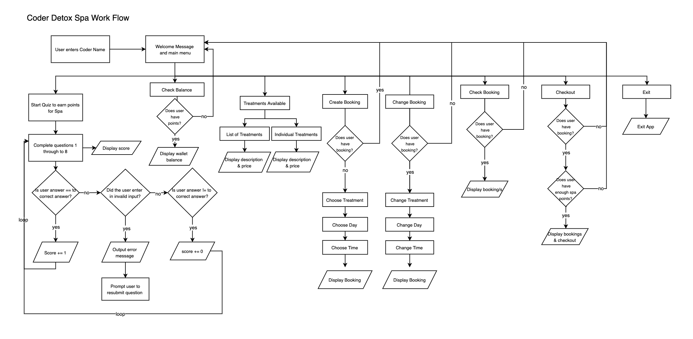
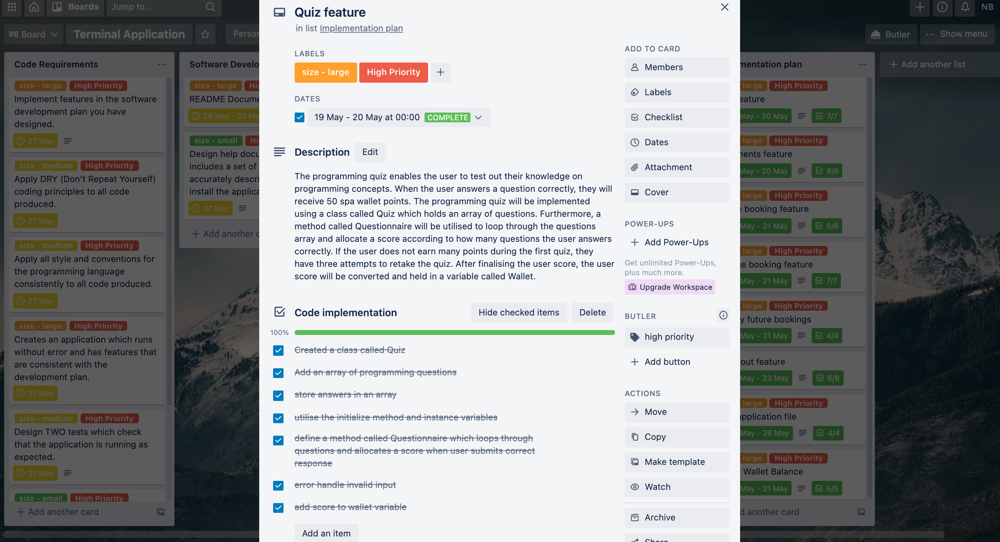
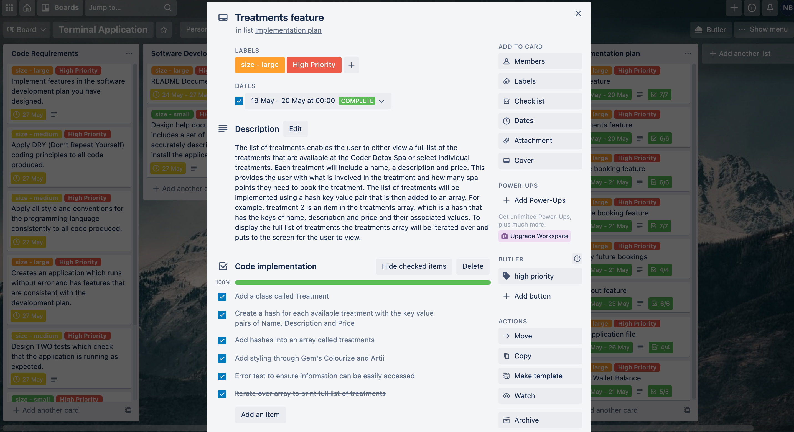
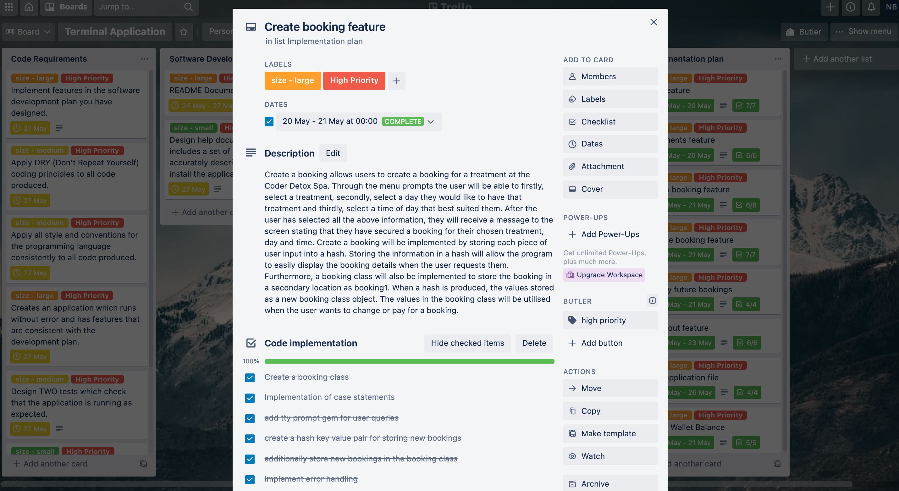
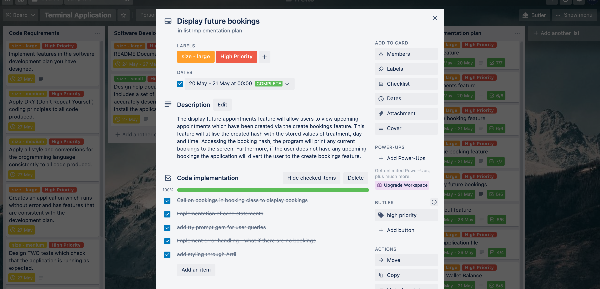
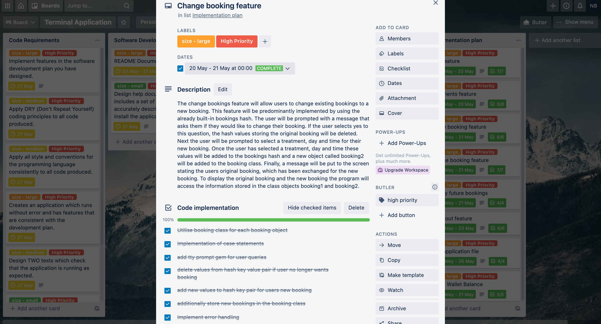
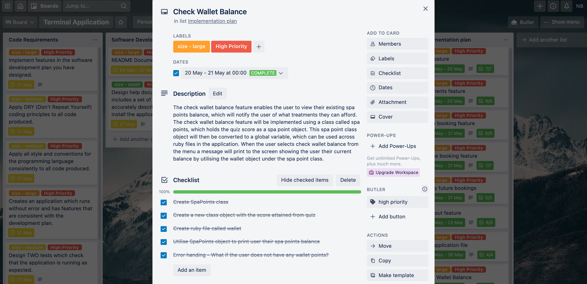
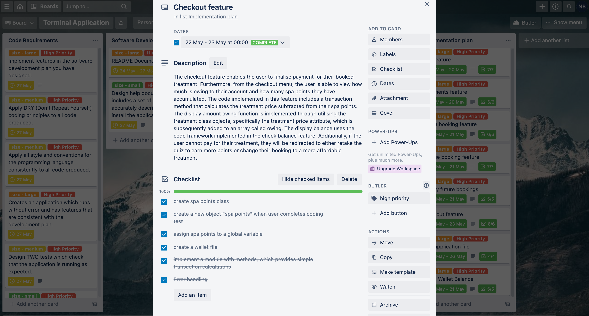

# README DOCUMENTATION 

# Link to Source Control Repository

A link to my source control repository can be found [here](https://github.com/NatalieLouise91/T1A3)

# **Software Development Plan** 

## **Coder Detox Spa Overview**

The coder detox spa is a two-part application that allows users to complete a quiz on programming to earn points for their spa wallet. Each correct answer in the quiz earns the user 50 points for their spa wallet. After the user has completed the quiz, they can spend their earnings at the coder detox spa. The coder detox spa is the second part of the application, enabling the user to book in for spa treatments and pay for those treatments using the wallet points earned in the quiz. 

### **Statement of Purpose**

The purpose of the application is to provide an interactive way for programming students to revise course content. If they can answer questions correctly, they can reward themselves by attending the detox spa. The Coder Detox Spa application is being developed to fulfil a need for students to take a different approach to study content. The application aims to implement a virtual reward system for the long hours required to understand concepts in programming successfully. The aim is to create a basic framework for the quiz that can easily be amended according to each term's content. Furthermore, the list of detox treatments for stressed-out coders can also be changed with ease. This application aims to solve the problem of how students can maintain an equilibrium between keeping up with course content and maintaining mental health. While the Coder Detox Spa is virtual, it does have an aim to destress and reduce student anxiety. 

### **Scope** 

The scope of the application will include the following deliverables: 

Part 1 of the application:

A quiz for users to test their programming knowledge, which will include:
- a test score, which converts to spa points 

Part 2 of the application:

A day spa booking system, which will include: 
-	A list of treatments
-	The option to create a booking
-	The option to change a booking 
-	The option to see a future booking 
-	A checkout, which utilises spa points

A scope limitation is that the application will provide the user with one set of programming questions in the quiz component; however, more questions can be included later. Furthermore, the Coder Detox Spa is a virtual booking simulation and does not provide the user with any real spa services. 

### **Target Audience** 

The target audience has an interest in learning programming and requires an added incentive to increase their motivation to study new programming concepts. This application will be best suited to students who would like to test their coding knowledge in a fun and engaging way. Furthermore, part 2 of the application, the Coder Detox Spa, is used as a study reward system for students once they have completed the quiz.

### **A Scenario of Application Usage** 

The user will initially be welcomed to Coder Detox Spa, and the application will ask the user to enter their name. After the user enters their name, they can take the programming quiz to earn points. If the user answers four questions correctly, they will earn 200 points to book in for a Coder Detox Facial at a specified day and time. At this point, the user may decide that they do not want a Coder Detox Facial, so they return to the main menu and select change booking, in which they select a new treatment, day and time. The application then confirms with the user that they want to change to the new booking. The user has received their treatment and can go back to studying. 

## **List of Features Included**  

### **Programming Quiz**

The programming quiz enables the user to test out their knowledge on programming concepts. When the user answers a question correctly, they will receive 50 spa wallet points. The programming quiz will be implemented using a class called quiz, which holds an array of questions. Furthermore, a method called questionnaire will be utilised to loop through the questions array and allocate a score according to how many questions the user answers correctly. If the user does not earn many points during the first quiz, they have three attempts to retake it. After finalising the user score, the user score will be converted and held in a global variable called Wallet. 

### **List of Treatments**

The list of treatments enables the user to either view a complete list of the available treatments at the Coder Detox Spa or select individual treatments. Each treatment will include a name, a description and a price. This provides the user with what is involved in the treatment and how many spa points they need to book the treatment. The list of treatments will be implemented using a hash key-value pair that is then added to an array. For example, treatment 2 is an item in the treatments array, which is a hash that has the keys of name, description and price and their associated values. The program iterates over the treatments array and prints to the screen for the user to view to display the complete list of treatments.    

### **Create a Booking**

Create a booking allows users to create a booking for a treatment at the Coder Detox Spa. Through the menu prompts, the user will be able to firstly select a treatment, secondly, select a day they would like to have that treatment and thirdly, select a time of day that best suited them. After the user has selected all the above information, they will receive a message to the screen stating that they have secured a booking for their chosen treatment, day and time. Create a booking will be implemented by storing each piece of user input into a hash. Storing the information in a hash will allow the program to display the booking details when the user requests them easily. Furthermore, a booking class will also be implemented to store the booking in a secondary location as booking1. When a hash is produced, the values stored as a new booking class object. The values in the booking class will be utilised when the user wants to change or pay for a booking.  

### **Display Future Appointments**

The Display Future Appointments feature will allow users to view upcoming appointments created via the create bookings feature. This feature will utilise the created hash with the stored values of treatment, day and time.  The program will access the bookings hash to print any current bookings to the screen. Furthermore, if the user does not have any upcoming bookings, the application will divert the user to the create bookings feature. 

### **Change Bookings** 

The change bookings feature will allow users to change existing bookings to a new booking. This feature will be predominantly implemented by using the already built-in bookings hash. The user will be prompted with a message that asks them if they would like to change their booking. If the user selects yes to this question, the hash values stored in the original booking will be deleted. Next, the user will be prompted to choose a treatment, day and time for their new booking. Once the user has selected a treatment, day and time these values will be added to the bookings hash and a new object called booking2 will be added to the booking class.  Finally, a message will be put to the screen stating the user's original booking, which has been exchanged for the new booking. To display the original booking and the new booking, the program will access the information stored in the class objects booking1 and booking2. 

### **Check Wallet Balance**

The check wallet balance feature enables the user to view their existing spa points balance, which will notify the user of what treatments they can afford. The check wallet balance feature will be implemented using a class called spa points, which holds the quiz score as a spa point object. This spa point class object will then be converted to a global variable, which can be used across ruby files in the application. When the user selects check wallet balance from the menu, a message will print to the screen showing the user their current balance by utilising the wallet object under the spa point class. 

### **Checkout**

The checkout feature enables the user to finalise payment for their booked treatment. Furthermore, from the checkout menu, the user is able to view how much is owing to their account and how many spa points they have accumulated. The code implemented in this feature includes a transaction method that calculates the treatment price subtracted from their spa points. The display amount owing function is implemented through utilising the treatment class objects, specifically the treatment price attribute, which is subsequently added to an array called owing. The display balance uses the code framework implemented in the check balance feature. Additionally, if the user cannot pay for their treatment, they will be redirected to either retake the quiz to earn more points or change their booking to a more affordable treatment.  

## **Outline of User Interaction** 

### **Welcome to the application**

-	The user is initially greeted with the heading "Welcome to Coder Detox Spa."

-	They are then asked to enter their name.

-	If the user does not type anything and presses enter, they receive a message saying, "I didn't quite catch that, please enter in a name." If the user continues to do this, after four times, they are given the default name “Incognito”.  

### **The main menu is displayed to the user**

This main menu utilises the tty-prompt gem and has the following options: 

####	**Start quiz**

-	The start quiz option takes the user to the programming quiz. The user will be given instructions to read then the user completes the quiz. The user will have to determine whether a statement is either true or false
-	If the user does not type in either true or false an error message will display on the screen and prompt the user to type in either true or false

####	**Check balance**

-	Displays to the user their available balance. If the user has not completed the quiz, they will receive a message stating that they do not have any spa points yet and are encouraged to take the quiz. 

####	**Treatments available**

-	This option diverts the user to a treatment menu. From the treatment menu, the user can select:

1.	Full list of treatments

-	displays all treatments together on the screen with their name, description and price

2. A Tasty Treat

-	displays description and price

3. Detox Facial

-	displays description and price

4. New Hair, Who Dis?

-	displays description and price

5. Coder Special

-	displays description and price

6. Stack Overflow Enlightenment

-	displays description and price

All selections are made utilising the tty-prompt gem

####	**Create booking**

-	This option presents the user with the following information:
-	Please select your treatment
-	Please select your day
-	Please select your time
-	All selections are made utilising the tty-prompt gem
-	The user must complete the quiz prior to creating a booking. If they do not have any spa points, they will be presented with the following statement “You do not have any spa points yet. You cannot make a booking without any spa points. Before you can relax, you must complete the programming quiz.”

####	**Change booking**

-	This option displays the user’s current booking
-	States that this booking will be deleted 
-	Then runs through the same steps as the Create Booking option:
-	Please select your treatment
-	Please select your day
-	Please select your time
-	All selections are made utilising the tty-prompt gem
-	The user must have a booking prior to selecting the Change Booking option. If the user does not have a booking, they will be presented with the following statement “I’m sorry, it     appears that you do not have a booking yet. Select Create Booking from the main menu.”

####	**Display booking**

-	This option displays the user's current booking.
-	If the user does not have a booking, they will be presented with the following statement “I’m sorry, it appears that you do not have a booking yet. Select Create Booking from the main menu.”

####	**Checkout Menu**

-	This option displays the checkout menu, which has the following items:

1.	Check Balance

-	Displays to the user their available balance.
-	If the user does not have any points, they receive a message stating that they do not have any spa points yet and are encouraged to take the quiz.

2.	Amount Owing

-	Displays to the user the amount they owe for their treatment
-	If the user has not booked a treatment, they receive a message stating that they do not owe anything today.

3.	Checkout

-	Transacts the sale by deducting the treatment price from the spa points
-	If the user does not have enough spa points, they receive a message stating that they do not have enough points to pay for their treatment and that they can either change their treatment or retake the quiz.

4.	Main Menu

-	Redirects the user to the main menu

5.	Exit

- Farewells the user and exits the application

### **Errors that may be raised during the application**

Entering in invalid input:

When the user enters an empty name, this error is saved using a while loop and giving the user four attempts before assigning the user with the default name "Incognito". Another example of invalid input in the application includes when the user enters in neither true nor false for the quiz statements. This is saved by raising an InvalidInputError custom error which is derived from StandardError. In this case, the user receives a message to use true or false for their answer. 

## Control Flow Diagram

## **Implementation Plan**

The implementation of the project was assisted by utilising a Trello board by Trello Software. The following images show a breakdown for the planning of the application:

### **Main Trello Board**

### **Quiz Feature**

### **List of Treatments Feature**

### **Create a Booking Feature**

### **Display Booking Feature**

### **Change Booking Feature**

### **Check Wallet Balance Feature**

### **Checkout Feature**

## **Help Documentation**

### **Installation Instructions**

You will need Ruby installed on your computer to run this program. Instructions on how to install Ruby can be found [here](https://www.ruby-lang.org/en/downloads/)

In addition to Ruby, the following Ruby Gem dependencies will need to be installed to successfully run Coder Detox Spa:

gem "tty-prompt", "~> 0.23.1"

gem "colorize", "~> 0.8.1"

gem "artii", "~> 2.1"

gem "tty-font", "~> 0.5.0"

gem "tty-progressbar", "~> 0.18.2"

gem "tty-box", "~> 0.7.0"

gem "pastel", "~> 0.8.0"

You can install the required Ruby gems through the command line using the following commands:

For tty-prompt: 

`gem install tty-prompt`

For colorize: 

`gem install colorize`

For artii: 

`gem install artii`

For tty-font:

`gem install tty-font`

For tty-progressbar:

`gem install tty-progressbar`

For tty-box:

`gem install tty-box`

For pastel:

`gem install pastel`

### Running Coder Detox Spa

The Coder Detox Spa application runs via the command line using a bash script file. After installing Ruby and the Gem dependencies, you will be able to run the following command through your terminal to execute the program:

`./run_app.sh`